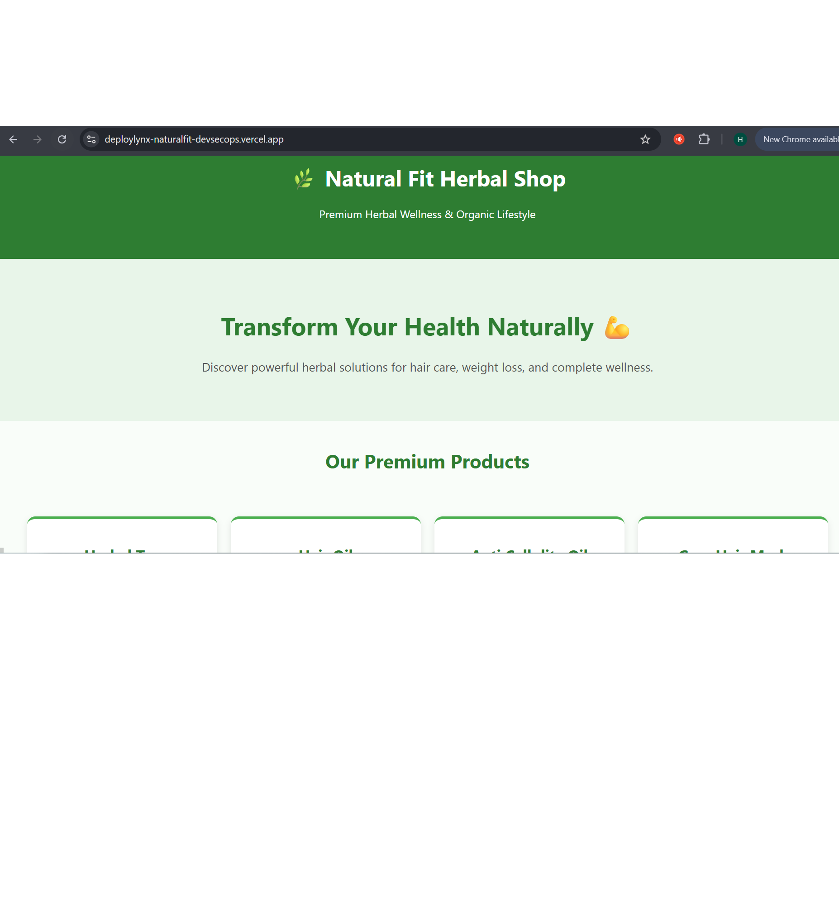

# DevSecOps Pipeline - Natural Fit

A DevSecOps CI/CD pipeline project developed by **Hina Atif** for **DeployLynx.com** as part of a professional project-based assignment. This project demonstrates a full DevSecOps workflow using **Node.js**, **Express**, **Docker**, **GitHub Actions**, and **Trivy security scanning**.

---

## 📝 Project Overview

**Objective:** Build and secure a Node.js application with a production-ready CI/CD pipeline, incorporating automated builds, dependency scanning, and containerization.

**Tech Stack & Tools Used:**

- **Node.js 18 (Alpine)** – Lightweight, secure Node.js environment
- **Express** – Robust web server framework
- **Docker** – Containerization of the application
- **GitHub Actions** – CI/CD workflow automation
- **Trivy** – Container image vulnerability scanning
- **Vercel** – Deployment for the live production environment

---

## 📂 Project Structure

```text
deploylynx-naturalfit-devsecops/
│
├── .github/
│   └── workflows/
│       └── devsecops.yml   # GitHub Actions workflow
├── app/                    # Node.js app source code
│   ├── public/             # Static frontend files
│   │   ├── index.html
│   │   └── style.css
│   └── screenshots/        # Project documentation images
│       ├── local.png
│       └── vercel.png
├── Dockerfile              # Container build instructions
├── .gitignore              # Files excluded from version control
└── README.md

---

⚡ Setup Instructions
Clone Repository

Bash
git clone [https://github.com/Deploylynx/deploylynx-naturalfit-devsecops.git](https://github.com/Deploylynx/deploylynx-naturalfit-devsecops.git)
cd deploylynx-naturalfit-devsecops

---
Run Locally (with Node.js)
Bash
cd app
npm install
node index.js

Build & Run with Docker
Bash
docker build -t naturalfit-app .
docker run -p 3000:3000 naturalfit-app


🖥️ Project Screenshots
### Local Development Environment


### Vercel Deployed Environment


🔒 DevSecOps Implementation
Security Middleware (Helmet)
We use Helmet.js to secure Express apps by setting various HTTP headers.

JavaScript
const helmet = require('helmet');
app.use(helmet());

---

Repository Management & Scanning
Clean Repo: Sensitive files like .env and bulky folders like node_modules are strictly ignored.

Vulnerability Scanning: Trivy scans every Docker build automatically within the GitHub Actions pipeline to catch security flaws before deployment.

---

Dockerfile Highlights
Base Image: Uses node:18-alpine for a reduced attack surface.

Principle of Least Privilege: Copies only necessary package files before source code to optimize build caching.

---

👨‍💻 Author & Project Info
Hina Atif – Project Developer
This project was completed as a case study for DeployLynx.com, showcasing hands-on DevSecOps and cloud infrastructure skills.

Live Deployed Site: View on Vercel


