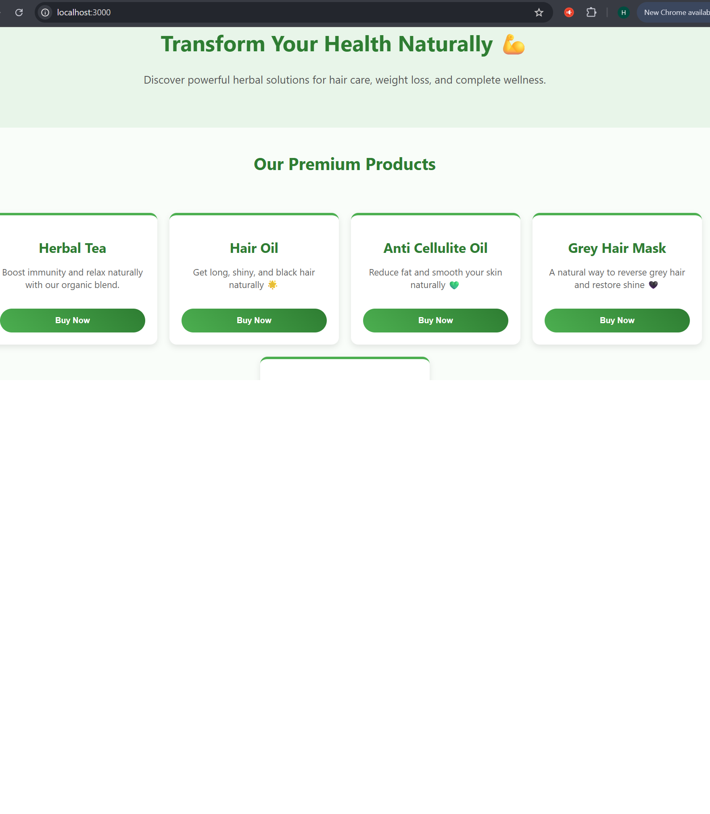

# DevSecOps Pipeline - Natural Fit

A DevSecOps CI/CD pipeline project developed by **Hina Atif** for DeployLynx.com as part of a project-based assignment.  
This project demonstrates a full DevSecOps workflow using **Node.js**, **Express**, **Docker**, **GitHub Actions**, and **Trivy security scanning**.

---

## 📝 Project Overview

**Objective:**  
Build and secure a Node.js application with a CI/CD pipeline, incorporating automated builds, dependency scanning, and containerization.

**Tech Stack & Tools Used:**

- **Node.js 18 (Alpine)** – Lightweight Node.js environment  
- **Express** – Web server framework  
- **Docker** – Containerization of application  
- **GitHub Actions** – CI/CD workflow automation  
- **Trivy** – Container image vulnerability scanning  
- **npm** – Node.js dependency management  
- **Vercel** – Deployment of static and dynamic apps  

---

## 📂 Project Structure

deploylynx-naturalfit-devsecops/
│
├── .github/
│ └── workflows/
│ └── devsecops.yml # GitHub Actions workflow
├── app/ # Node.js app source code
│ ├── package.json
│ ├── package-lock.json
│ ├── index.js
│ ├── public/
│ │ ├── index.html
│ │ └── style.css
│ └── screenshots/
│ ├── local.png
│ └── vercel.png
├── Dockerfile # Container build instructions
├── docker-compose.yml # Optional local multi-container setup
├── README.md
└── .gitignore


---

## ⚡ Setup Instructions

1. **Clone Repository**

```bash
git clone https://github.com/Deploylynx/deploylynx-naturalfit-devsecops.git
cd deploylynx-naturalfit-devsecops/app


---
Install Dependencies
npm install
Run Locally
node index.js

Open your browser at: http://localhost:3000

Build & Run with Docker
docker build -t naturalfit-app .
docker run -p 3000:3000 naturalfit-app

GitHub Actions CI/CD
Every push to the main branch triggers:
Docker image build
Trivy security scan
Workflow file: .github/workflows/devsecops.yml
Optional: Docker Compose
docker-compose up --build

## 🖥️ Screenshots

Local site:



Deployed site:


---

## 🖥️ Screenshots

Local site:


Deployed site:


---

🔒 DevSecOps Implementation

Express Security Middleware (Helmet):

const helmet = require('helmet');
app.use(helmet());

Security & Repo Management:

.env file ignored in .gitignore
Unnecessary files ignored: node_modules, .DS_Store, Thumbs.db, *.log
Trivy scans Docker images automatically in GitHub Actions workflow

Dockerfile Highlights:

🔒 DevSecOps Implementation

Express Security Middleware (Helmet):

const helmet = require('helmet');
app.use(helmet());

Security & Repo Management:

.env file ignored in .gitignore
Unnecessary files ignored: node_modules, .DS_Store, Thumbs.db, *.log
Trivy scans Docker images automatically in GitHub Actions workflow

Dockerfile Highlights:
Base image: node:18-alpine
Copies package.json and installs dependencies
Copies app source code
Exposes port 3000

GitHub Actions Workflow Highlights:

---

- name: Build Docker Image
  run: docker build -t naturalfit-app .

- name: Scan Docker Image with Trivy
  run: trivy image naturalfit-app

  ---

  👨‍💻 Author & Project Info

Hina Atif – Project Developer
This project was completed as a case study for DeployLynx.com, showcasing hands-on DevSecOps skills.

Live Deployed Site: https://deploylynx-naturalfit-devsecops.vercel.app

---

**About:**  
Production-ready DevSecOps pipeline for a herbal e-commerce application using Docker, GitHub Actions, and Trivy security scanning | DeployLynx Case Study


